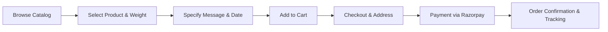
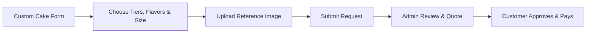

# User Flows

## 1. Standard Cake Ordering Flow

```mermaid
flowchart LR
    A[Browse Catalog] --> B[Select Product & Weight]
    B --> C[Specify Message & Date]
    C --> D[Add to Cart]
    D --> E[Checkout & Address]
    E --> F[Payment via Razorpay]
    F --> G[Order Confirmation & Tracking]
```

## 2. Custom Cake Inquiry Flow

```mermaid
flowchart LR
    A[Custom Cake Form] --> B[Choose Tiers, Flavors & Size]
    B --> C[Upload Reference Image]
    C --> D[Submit Request]
    D --> E[Admin Review & Quote]
    E --> F[Customer Approves & Pays]
```
