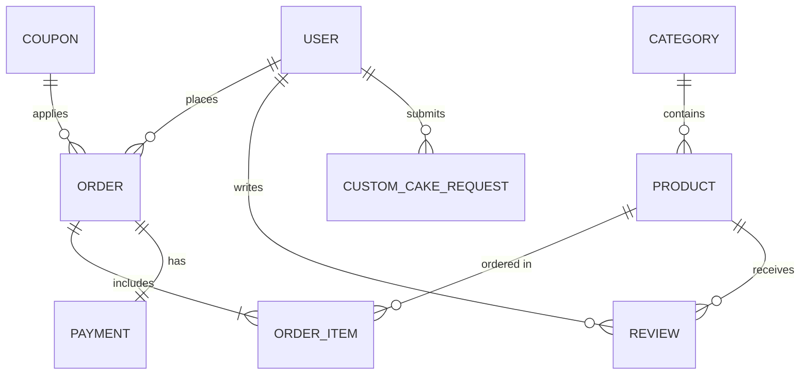

# Entity-Relationship Diagram

```mermaid
erDiagram
    USER ||--o{ ORDER : places
    USER ||--o{ REVIEW : writes
    USER ||--o{ CUSTOM_CAKE_REQUEST : submits
    CATEGORY ||--o{ PRODUCT : contains
    ORDER ||--|{ ORDER_ITEM : includes
    ORDER ||--|| PAYMENT : has
    PRODUCT ||--o{ ORDER_ITEM : "ordered in"
    PRODUCT ||--o{ REVIEW : receives
    COUPON ||--o{ ORDER : applies
```
